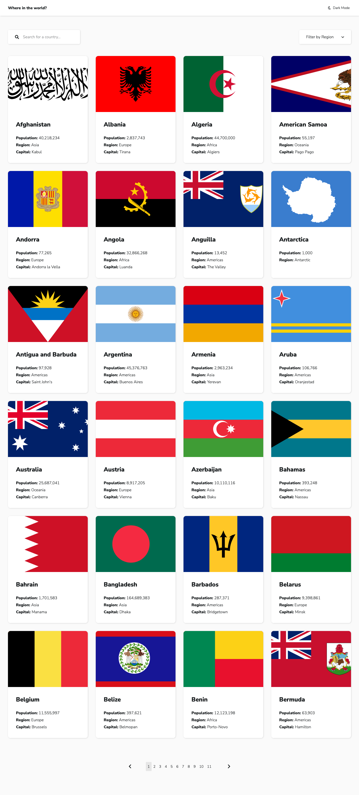

# Frontend Mentor - REST Countries API with color theme switcher solution

This is a solution to the [REST Countries API with color theme switcher challenge on Frontend Mentor](https://www.frontendmentor.io/challenges/rest-countries-api-with-color-theme-switcher-5cacc469fec04111f7b848ca).

## Overview

### The challenge

Users should be able to:

- See all countries from the API on the homepage
- Search for a country using an `input` field
- Filter countries by region
- Click on a country to see more detailed information on a separate page
- Click through to the border countries on the detail page
- Toggle the color scheme between light and dark mode _(optional)_

### Screenshot

### Links

- Live Site URL: [https://mmcampbell04.github.io/Countries-App/](https://mmcampbell04.github.io/Countries-App/)

### Built with

- [React](https://reactjs.org/) - JS library
- [Styled Components](https://styled-components.com/) - For styles

### Extras

- Pagination functionality thanks to tutorial from Traversy Media
- Loader & error messages

### What I learned

- This was the first time using Styled Components, there is likely still some refactoring to go
- The logic behind the pages component

### Future Plans/Further Adaptions

- I'd like to figure out a way to make the custom dropdown fully accessible, likely need another librbary... (?)
